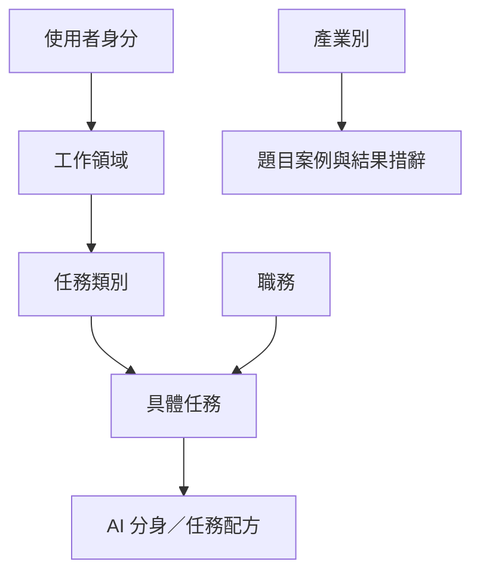

# SCI 網站族群、工作領域與任務分類規格

> 版本：1.0｜語系：繁體中文（台灣）｜用途：網站問卷、SCI 計分、AI 分身推薦與設備推薦

## 1. 目的與使用範圍

使用者先選擇 **SOHO／教育／中小企業**，再選工作領域及日常任務。系統以實際工作流計算現況 SCI，估算導入 Agentic AI 後可改善的時間、作業成本與目標 SCI，最後依任務負載推薦 AI 分身組合及合適設備。

分類是用來**找到貼近使用者的任務**，不能直接替代工作流資料或決定分數。同一任務在不同族群可共用估算邏輯，但顯示不同案例與文案。

### 用語對照

| 原用語 | 網站建議顯示 | 備註 |
| --- | --- | --- |
| Persona | 使用者身分 | 固定三選一：SOHO／教育／中小企業；SOHO 可輔以「自由工作者／一人工作室」說明。 |
| Function | 工作領域 | 教育族群顯示「你的主要身分或工作」，其餘顯示「你的主要工作領域」。 |
| Role | 職務／專長 | 可選；用於預選任務及調整案例，不作必填關卡。 |
| Task Cluster | 任務類別 | 用來分組呈現任務。 |
| Task | 具體工作任務 | 計分與推薦的最小選擇單位。 |
| Agent／Recipe | AI 分身／任務配方 | 配方是 AI 分身處理任務的設定；同一分身可支援多項任務。 |
| Industry | 產業別 | 可選，用於案例與措辭；不因產業名稱自動增減 SCI。 |

## 2. 分類原則

1. **族群互斥，任務可跨族群共用。** 使用者只能選一個主要身分，但一項任務可以掛在多個工作領域。保留「跨領域工作」入口供兼職或複合職務補選。
2. **領域是導覽，不是計分維度。** 例如「社群貼文」可同時出現在 SOHO 行銷與中小企業行銷，底層共用任務 ID。
3. **職務是推薦預設值。** 像「研究生」同時可能做文獻、程式與教學工作，不應被鎖在單一路徑。
4. **任務要能回答頻率、工時與流程問題。** 「行銷」「研究」太籠統；「撰寫社群貼文」「整理研究文獻」才是可測量任務。
5. **用常見中文命名。** SEO、UI／UX、CRM、SQL、KPI、KOL 等台灣業界常用縮寫可保留，首次出現時補中文。
6. **敏感任務保留人員核對。** 財務、法務、醫療、學生評量、招募與資訊安全等僅估算可輔助的步驟，不預設可完全自動決策。

## 3. SOHO：自由工作者／一人工作室

適用於個人接案、創作者及以一人或小型團隊運作的事業。若使用者以部門分工管理公司，優先引導至中小企業。

| 工作領域 | 常見職務／專長（可選） | 任務類別 → 具體任務（建議初始選項） |
| --- | --- | --- |
| **設計與創作** | 平面設計師、UI／UX 設計師、網頁設計師、影片剪輯師、攝影師、動態影像／3D 設計師、插畫家 | **企劃與提案**：蒐集視覺參考、發想設計概念、整理客戶需求、彙整修改意見、製作提案簡報；**圖像製作**：圖片去背與尺寸調整、修圖、延伸多尺寸橫幅廣告；**影音製作**：整理腳本、剪輯短影音、產生及校對字幕；**素材管理**：素材命名、分類與檢索。 |
| **行銷與內容** | 社群經營者、內容創作者、文案企劃、SEO 專員、數位廣告投手、KOL／網紅、品牌行銷企劃 | **內容產出**：撰寫社群貼文、改寫文案、製作電子報（EDM）、撰寫 SEO 文章；**活動與廣告**：發想活動企劃、製作廣告文案及素材變體、研究關鍵字及標籤；**研究與分析**：競品分析、整理廣告成效、製作週報／月報、整理 KOL 合作名單；**社群互動**：分類留言與撰擬回覆。 |
| **商務與顧問** | 顧問、企業顧問、接案業務、專案經理、客戶經理、商務開發、教練／講師 | **客戶溝通**：整理需求、準備會議資料、產出會議紀錄、撰寫會後追蹤信；**提案與文件**：撰寫企劃提案、報價單草稿、簡報及報告；**分析與管理**：市場研究、安排專案時程、追蹤待辦事項。 |
| **技術與開發** | 軟體工程師、網站工程師、App 工程師、資料分析師、AI 開發者、自動化工程師、接案資訊人員 | **程式開發**：撰寫程式碼、程式碼審查、除錯、產生測試案例；**技術研究**：整理 API 文件、摘要技術文件、查找 GitHub 與技術社群資訊；**資料與自動化**：清理資料、撰寫 SQL 查詢、製作儀表板、自動化腳本、分析系統紀錄。 |
| **電商與營運** | 電商賣家、網路商店經營者、平台賣家、小型品牌主理人、經銷商 | **商品管理**：撰寫商品描述、整理 SKU／品項、製作商品圖；**訂單與客服**：整理訂單、建立客服常見問題、分類顧客評論；**庫存與成效**：彙整庫存、分析銷售、比較競品價格；**促銷**：撰寫促銷文案。 |
| **行政與專業服務** | 遠端行政助理、記帳人員、譯者、法律服務接案者、研究助理、行政接案者 | **文件與資料**：整理試算表、摘要 PDF、資料輸入及分類；**帳務**：整理發票與收據、產生請款資料草稿；**溝通與排程**：撰寫電子郵件、安排時程；**專業支援**：翻譯與校對、摘要合約供人工檢閱、蒐集研究資料。 |

## 4. 教育：學生、教學、研究與校園支援

教育族群的第二步應問「**你的主要身分或工作是什麼？**」。同一人可兼具教學、研究及行政任務，因此第三步允許跨類別補選。

| 主要身分或工作 | 常見職務／專長（可選） | 任務類別 → 具體任務（建議初始選項） |
| --- | --- | --- |
| **學生** | 大學生、研究生、理工科學生、商管／社科學生、設計／藝術學生、人文／語言學生 | **學習與作業**：整理課堂筆記、摘要 PDF、製作考前重點、建立作業大綱；**研究與報告**：搜尋資料、整理文獻與引用格式、撰寫報告、製作簡報；**技術與語言**：輔助撰寫程式、分析資料、翻譯與校對。作業內容需由學生自行確認，依課程規範使用 AI。 |
| **教師與教學人員** | 國中小／高中職教師、大學講師、大學教師、家教、語言教師、技職培訓講師 | **備課與教材**：設計教案、製作教材與簡報；**評量**：生成測驗題、建立評分規準、輔助批改與彙整學習成果；**班級溝通**：整理學生回饋、撰寫課程公告及電子郵件。評分與個別學生判斷須由教師核對。 |
| **學術研究** | 計畫主持人、博士生、研究員、研究助理、實驗室成員 | **文獻**：搜尋論文、摘要論文、彙整文獻、擷取 PDF 資訊、整理引用；**實驗與資料**：整理實驗資料、統計分析、撰寫程式、產生資料視覺化；**寫作與管理**：研究論文草稿、回覆審查意見草稿、研究計畫書草稿、研究知識整理。 |
| **教育行政** | 學校行政人員、系所行政、教務人員、招生人員、學務人員、專案承辦人 | **文件與溝通**：摘要公文、撰寫電子郵件、整理會議紀錄、文件分類；**資料與排程**：整理報名資料與學生名單、安排課程、製作報表；**服務與活動**：建立常見問題、彙整活動資訊。 |
| **教材與培訓內容** | 教學設計師、企業內訓講師、課程創作者、線上教師、教育科技內容企劃 | **課程設計**：規劃課綱與學習單元；**內容製作**：撰寫教材、投影片、講義、影片腳本及字幕、改寫不同程度的學習內容；**評量與成效**：生成測驗題、分析課程回饋及學習成果。 |
| **校園資訊與實驗室支援** | 校園資訊人員、實驗室技術員、系統管理員、AI 實驗室工程師、計算中心人員 | **技術支援**：分類報修單、整理使用者問題、設備設定說明；**系統管理**：分析紀錄檔、撰寫系統文件；**資料與運算**：自動化腳本、資料處理、AI 模型測試。 |

## 5. 中小企業：依部門或業務職能分類

適用於有跨人員協作、固定營運流程或部門分工的公司。負責人可選「管理與策略」，再跨類別補選自己實際執行的工作。

| 工作領域 | 常見職務／專長（可選） | 任務類別 → 具體任務（建議初始選項） |
| --- | --- | --- |
| **行銷** | 行銷經理、數位行銷專員、社群經營者、內容行銷專員、品牌行銷企劃 | **內容與活動**：社群貼文、電子報、活動提案、廣告文案、SEO 文章；**研究與成效**：市場研究、競品分析、行銷報告、KOL 名單研究。 |
| **業務與商務開發** | 業務人員、商務開發、客戶經理、業務營運人員 | **名單與接洽**：研究潛在客戶、撰寫開發信、摘要客戶資料、準備會議；**提案與追蹤**：提案、報價草稿、會後追蹤、更新客戶關係管理系統（CRM）、商機進度報告。 |
| **客服與客戶成功** | 客服專員、客戶成功專員、服務台人員、社群客服 | **案件處理**：分類客服案件、摘要客訴、撰擬電子郵件回覆與建議話術；**知識管理**：建立常見問題與知識庫、彙整顧客回饋及常見問題趨勢。 |
| **營運與採購** | 營運經理、營運專員、採購人員、供應鏈人員、辦公室行政 | **流程與文件**：撰寫標準作業流程（SOP）、整理文件、會議紀錄及工作進度；**採購與庫存**：比較採購方案、整理供應商資料、彙整庫存；**報表**：營運報表與關鍵績效指標（KPI）報告。 |
| **財務與會計** | 會計人員、財務人員、記帳人員、財務規劃與分析人員、財務營運人員 | **憑證與帳務**：收據文字辨識、整理發票、費用分類、對帳輔助及資料輸入；**規劃與報表**：預算草稿、預實差異分析、財務報表草稿、現金流資料整理。金額、稅務與帳務結論須人工覆核。 |
| **人資與人才發展** | 人資專員、招募人員、人資營運人員、教育訓練人員、部門主管 | **招募**：撰寫職缺說明、摘要履歷、彙整候選人資料、整理面試紀錄；**到職與訓練**：新人到職清單、員工制度常見問題、培訓教材；**分析**：員工問卷彙整。錄用與人事判斷由人員決定。 |
| **資訊與開發** | 系統管理員、開發工程師、資料分析師、AI 工程師、維運工程師 | **開發與維運**：撰寫程式、除錯、測試、分類資訊服務單、分析紀錄檔；**資料與自動化**：SQL、報表、流程自動化、模型推論作業；**文件**：技術與系統文件。資訊安全相關輸出須覆核。 |
| **管理與策略** | 創辦人、企業主、總經理、部門主管、策略企劃 | **經營檢視**：整理營運回顧、KPI、內部報告及會議紀錄；**研究與規劃**：市場趨勢、競品分析、策略備忘錄、業績預測及情境規劃。預測結果應呈現假設與不確定性。 |
| **零售與電商** | 電商經理、門市主管、商品企劃、電商平台營運人員 | **商品與訂單**：撰寫商品文案、商品分類、商品圖、整理訂單；**顧客與促銷**：分類顧客評論、促銷企劃；**分析**：銷售分析、價格監測。 |

## 6. 跨族群產業別（可選）

產業別是**輔助標籤**，用於任務例子、名詞及推薦情境。使用者未選時仍可完成測驗。教育族群可預設「教育與培訓」，但允許改選，如企業內訓或醫學研究。

| 選項 | 範圍示例 |
| --- | --- |
| 科技與資訊服務 | 軟體、硬體、資訊服務。 |
| 零售與電商 | 門市、品牌電商、平台賣家。 |
| 製造業 | 工廠、生產與零組件。 |
| 專業服務 | 顧問、會計、法律服務等。 |
| 金融與保險 | 金融服務、保險。 |
| 醫療與健康 | 醫療機構、健康服務。 |
| 教育與培訓 | 學校、補教、企業培訓。 |
| 媒體、設計與娛樂 | 內容製作、廣告、設計。 |
| 餐飲、旅宿與觀光 | 餐飲、飯店與旅遊。 |
| 不動產與營建 | 房仲、建築、工程。 |
| 政府與非營利組織 | 公部門、協會、基金會。 |
| 其他 | 可填寫簡短描述。 |

## 7. 網站問卷流程

| 步驟 | 題目與互動 | 系統用途 |
| --- | --- | --- |
| 1. 身分 | 「你目前最符合哪一種工作情境？」選 **SOHO／教育／中小企業**。每項附一句說明。 | 決定首頁任務卡及文案。 |
| 2. 主要領域 | SOHO／中小企業問「你的主要工作領域是？」；教育問「你的主要身分或工作是？」單選一項。 | 決定優先顯示的任務類別。 |
| 3. 常做任務 | 「哪些工作最花你的時間？」顯示約 8–12 項相關任務，建議選 3–5 項；提供搜尋、「其他工作」與跨領域補選。 | 決定實際要詢問的工作流與可改善空間。 |
| 4. 工作流測量 | 針對已選任務詢問每週／每月件數、每件花費時間、目前工具與人工步驟、錯誤或返工、必要審核；成本欄位可選填。 | 計算現況及導入 AI 後的合理情境。 |
| 5. 結果與推薦 | 顯示現況 SCI、目標 SCI、可節省時間、作業成本估算、最適合先導入的任務、AI 分身及設備建議。 | 呈現假設、推薦理由與導入順序。 |

**職務不用獨立設成必答步驟。** 若需提高精準度，可在第 2 步後以可略過的「更接近你的職務」標籤供選擇；未選職務時由領域與任務推斷。結果頁應允許回頭修改任務及頻率，避免第一次選錯就得重測。

## 8. SCI 與推薦的對應規則

1. **計分輸入以任務和工作流為主。** 族群、領域、職務與產業只決定候選題目及呈現方式；不要把某個職稱直接設定為「高 SCI」或「低 SCI」。
2. **先顯示目前狀態，再估導入後情境。** 現況 SCI 衡量目前的工作流；目標 SCI 根據已選任務、可自動化步驟、審核與實際採用程度推估。需要在正式上線前另行定義 SCI 指標、權重、範圍及校準方法。
3. **時間節省逐任務估算。** 示例公式：`每月可節省時間 = 每月件數 × 每件原耗時 × 可由 AI 協助的比例 × 預期採用率 − 每月審核與維護時間`。各比例為情境假設，須顯示給使用者調整，不能視為既成效益。
4. **作業成本與設備總成本分開。** 若使用者提供時薪或人力成本，可估工時價值；若未提供，先顯示時間，不捏造現金節省。購置設備、部署、用電、維護、模型調整與審核成本要在投資比較中另列。
5. **推薦地端設備依任務負載。** 依文件量、模型大小、同時使用人數、影像／影片需求、資料敏感度、回應速度及離線需求匹配設備；不能只按職務推薦高階機種。
6. **Token 呈現須定義比較基準。** 同一模型執行同一任務，移到地端不會天然減少 token。若要呈現「雲端 token 用量減少」，應明確寫為「轉至地端執行、因而不再向雲端 API 計費的估算 token」，並說明用量估算與成本假設；不可稱為模型實際少用了這些 token。

## 9. 建議資料模型與任務配方掛載

原本的單一路徑 `Persona → Function → Role → Task Cluster → Task` 可用來**顯示導覽**；資料庫應允許「一個任務出現在多個領域」及「一個配方對應多項任務」。因此使用穩定 ID 與關聯表，避免重複建立同名任務。



### 任務資料範例

```json
{
  "id": "task.social_post_draft",
  "label_zh_tw": "撰寫社群貼文",
  "cluster_id": "cluster.content_creation",
  "placements": [
    { "persona": "soho", "function_id": "soho.marketing_content" },
    { "persona": "smb", "function_id": "smb.marketing" }
  ],
  "workflow_questions": ["monthly_volume", "minutes_per_item", "review_minutes", "current_tools"],
  "recipe_ids": ["S02"],
  "human_review_required": true
}
```

`S02` 只是示意掛載方式；實際 ID 與任務關係須以現有 `recipeCatalog` 核對。若一項配方涵蓋「貼文草稿」「文案改寫」「標籤建議」，以一對多關聯表保存，不要只留一個 `task` 欄位。

### 每筆任務配方建議欄位

| 欄位 | 用途 |
| --- | --- |
| `id`、`name_zh_tw`、`summary_zh_tw` | 穩定識別碼、台灣用語名稱、對外功能說明。 |
| `task_ids[]` | 可支援的任務，對應多個工作領域時不複製配方。 |
| `workflow_steps[]`、`inputs[]`、`outputs[]` | 明確界定分身實際處理的步驟、輸入與產物。 |
| `automation_potential`、`review_required` | 可協助程度與人工覆核要求；需有評估依據，不直接轉成 SCI 分數。 |
| `local_ai_fit`、`hardware_requirements` | 地端適用性及所需記憶體、儲存、推論性能等條件。 |
| `data_sensitivity`、`quality_limitations` | 個資／機密程度與容易出錯的情況。 |
| `measurement_defaults` | 頻率、耗時與審核的初始值；供使用者修改，不能當成其真實工作量。 |

## 10. 上線前應補齊的定義

- **SCI 規則**：目前 SCI 與目標 SCI 的指標、權重、上限、缺漏值及驗證方式。分類本身不應被誤當成計分公式。
- **量測基準**：常見任務的件數、耗時、可協助步驟、審核時間及來源；預設值須可編輯。
- **配方盤點**：逐筆檢查既有 `S01、S02…`，建立任務對照表，標出重複能力、無對應任務與不足的任務類別。
- **設備矩陣**：各型號可支援的模型、記憶體、同時使用人數、影像／影片處理能力及建議負載，與配方需求連結。
- **結果說明**：將「潛在改善」「已實現節省」「雲端 API 用量轉移」分別標示，不混成同一個數字。

> **建議第一版實作範圍**：先上線三種身分、21 個工作領域／身分群組、共用任務清單及可調整的工作流題目；職務、產業與高階篩選作為漸進式補充。上表任務是初始候選清單，正式顯示的 8–12 項應依現有配方覆蓋度與目標受眾實測結果排序。
